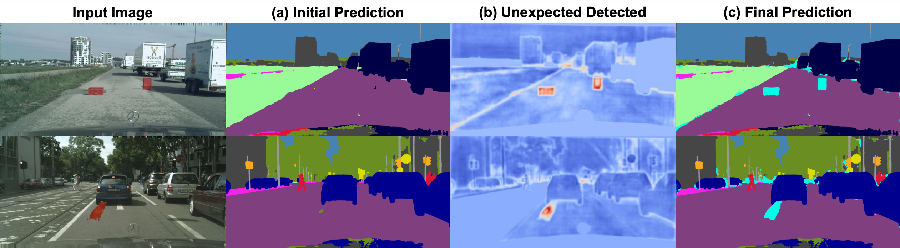
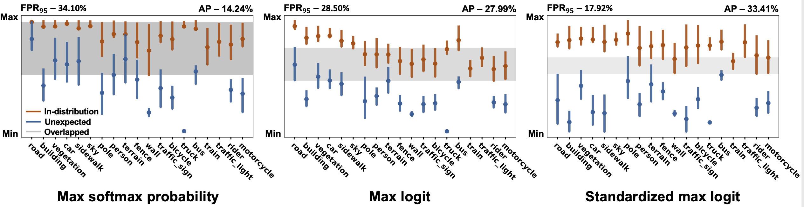
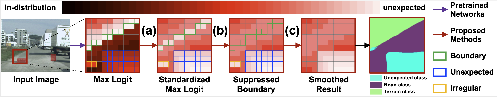
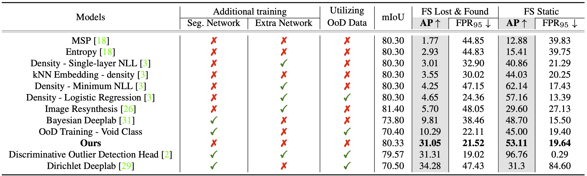
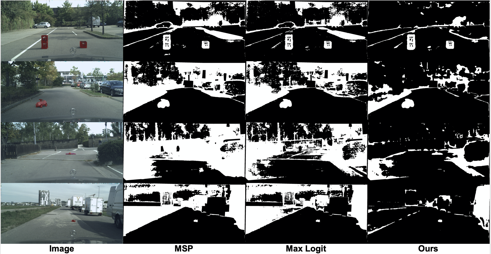

# SML (ICCV 2021, Oral) : Official Project Webpage - In preparation
This repository provides the official PyTorch implementation of the following paper:
> Standardized Max Logits: A Simple yet Effective Approach for Identifying Unexpected Road Obstacles in Urban-Scene Segmentation<br>
> [Sanghun Jung](https://shjung13.github.io/)* (KAIST AI), [Jungsoo Lee](https://leebebeto.github.io/)* (KAIST AI), Daehoon Gwak (KAIST AI)<br>
> [Sungha Choi](https://www.linkedin.com/in/sungha-choi-1130185a/) (LG AI Research), and [Jaegul Choo](https://sites.google.com/site/jaegulchoo/) (KAIST AI) (*: equal contribution)<br>
> ICCV 2021 (Oral) <br>

> Paper: [arxiv](https://arxiv.org/abs/2107.11264)<br>

> Youtube Video (English): [Youtube](https://www.youtube.com/watch?v=leBJZHzX6xM) <br>

> **Abstract:** 
*Identifying unexpected objects on roads in semantic segmentation (e.g., identifying dogs on roads) is crucial in safety-critical applications. 
Existing approaches use images of unexpected objects from external datasets or require additional training (e.g., retraining segmentation networks or training an extra network), which necessitate a non-trivial amount of labor intensity or lengthy inference time.
One possible alternative is to use prediction scores of a pre-trained network such as the max logits (i.e., maximum values among classes before the final softmax layer) for detecting such objects.
However, the distribution of max logits of each predicted class is significantly different from each other, which degrades the performance of identifying unexpected objects in urban-scene segmentation.
To address this issue, we propose a simple yet effective approach that standardizes the max logits in order to align the different distributions and reflect the relative meanings of max logits within each predicted class.
>Moreover, we consider the local regions from two different perspectives based on the intuition that neighboring pixels share similar semantic information. 
In contrast to previous approaches, our method does not utilize any external datasets or require additional training, which makes our method widely applicable to existing pre-trained segmentation models. 
Such a straightforward approach achieves a new state-of-the-art performance on the publicly available Fishyscapes Lost & Found leaderboard with a large margin.*<br>

<p align="center">
  
</p>

<p align="center">
  
</p>

## Code Contributors
[Sanghun Jung](https://shjung13.github.io/) (KAIST AI), [Jungsoo Lee](https://leebebeto.github.io/) (KAIST AI)

## Concept Video
Click the figure to watch the youtube video of our paper!
<p align="center">
  <a href="https://www.youtube.com/watch?v=leBJZHzX6xM"></a><br>
</p>

## Pytorch Implementation (In-Preparation)
### Installation
Clone this repository.
```
git clone https://github.com/shjung13/Standardized-max-logits.git
cd Standardized-max-logits
pip install -r requirements.txt
```
#### Data directory

```
cityscapes
 └ leftImg8bit_trainvaltest
   └ leftImg8bit
     └ train
     └ val
     └ test
 └ gtFine_trainvaltest
   └ gtFine
     └ train
     └ val
     └ test
```

### How to Run 
#### Obtain statistics from training samples
```
CUDA_VISIBLE_DEVICES=3 ./scripts/train_r101_os8_statistics.sh
```
#### SML + Iterative Boundary Suppression + Gaussian Smoothing
```
CUDA_VISIBLE_DEVICES=3 python eval.py
```

## Quantitative / Qualitative Evaluation
### Fishyscapes Learboard
<p align="center">
  
</p>

### Identified OoD pixels (colored white)
<p align="center">
  
</p>

## Fishyscapes Leaderboard
Our result is also available at [fishyscapes.com](https://fishyscapes.com/). 


## Acknowledgments
We deeply appreciate Hermann Blum and FishyScapesteam for their sincere help in providing the baseline perfor-mances and helping our team to update our model on theFishyScapes Leaderboard.
Our pytorch implementation is heavily derived from [NVIDIA segmentation](https://github.com/NVIDIA/semantic-segmentation) and [RobustNet](https://github.com/shachoi/RobustNet).
Thanks to the NVIDIA implementations.

